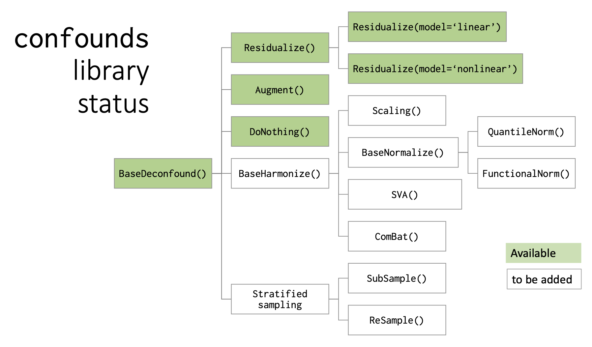

Conquering confounds and covariates in machine learning
------------------------------------------------------------

.. image:: https://github.com/raamana/confounds/blob/master/confounds_card.jpg

.. image:: https://zenodo.org/badge/197298208.svg
   :target: https://zenodo.org/badge/latestdoi/197298208

.. image:: https://img.shields.io/pypi/v/confounds.svg
        :target: https://pypi.python.org/pypi/confounds

.. image:: https://img.shields.io/travis/raamana/confounds.svg
        :target: https://travis-ci.org/raamana/confounds

News
~~~~~~~~~~~~~~~~

 - **Hackathon folks**: Those coming here from the hackathon, please go here to learn some ideas for contribution: https://github.com/ohbm/hackathon2021/issues/34

 - The previous slides for the OHBM Hackathon and Open Science Room are here: https://crossinvalidation.com/2020/03/04/conquering-confounds-and-covariates-in-machine-learning/

Vision / Goals
~~~~~~~~~~~~~~~

The high-level goals of this package is to develop high-quality library to conquer confounds and covariates in ML applications. By conquering, we mean methods and tools to

 1. visualize and establish the presence of confounds (e.g. quantifying confound-to-target relationships),
 2. offer solutions to handle them appropriately via correction or removal etc, and
 3. analyze the effect of the deconfounding methods in the processed data (e.g. ability to check if they worked at all, or if they introduced new or unwanted biases etc).

Documentation
~~~~~~~~~~~~~~

https://raamana.github.io/confounds

Methods
~~~~~~~~

Available:

 - Residualize (e.g. via regression)
 - Augment (include confounds as predictors)
 - Some utils

To be added:

 - Harmonize (correct batch effects via rescaling or normalization etc)
 - Stratify (sub- or re-sampling procedures to minimize confounding)
 - Full set of utilities (Goals 1 and 3)
 - reweight (based on propensity scores as in IPW, or based on confounds)
 - estimate propensity scores

In a more schematic way:

Resources
~~~~~~~~~
any useful resources; papers, presentations, lectures related to the problems of confounding can be found here https://github.com/raamana/confounds/blob/master/docs/references_confounds.rst

Citation
~~~~~~~~~~~~~~

If you found any parts of ``confounds`` to be useful in your research, directly or indirectly, **I'd appreciate if you could cite** the following:

 - Pradeep Reddy Raamana (2020), "Conquering confounds and covariates in machine learning with the python library confounds", Version 0.1.1, Zenodo. http://doi.org/10.5281/zenodo.3701528

Contributors are most welcome.
~~~~~~~~~~~~~~~~~~~~~~~~~~~~~~~~~~~~~~~~~~

Your contributions of all kinds will be greatly appreciated. Learn how to contribute to this repo `here <CONTRIBUTING.rst>`_.

All contributors making non-trivial contributions will be

 - publicly and clearly acknowledged on the `authors page <AUTHORS.rst>`_
 - become an author on the [software] paper to be published when it's ready soon.

